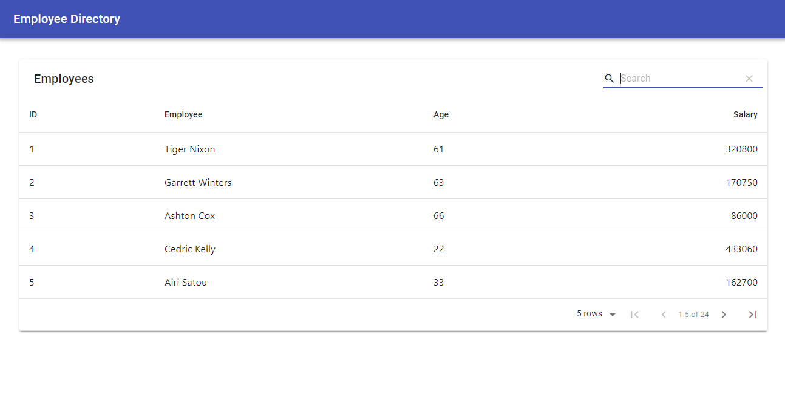
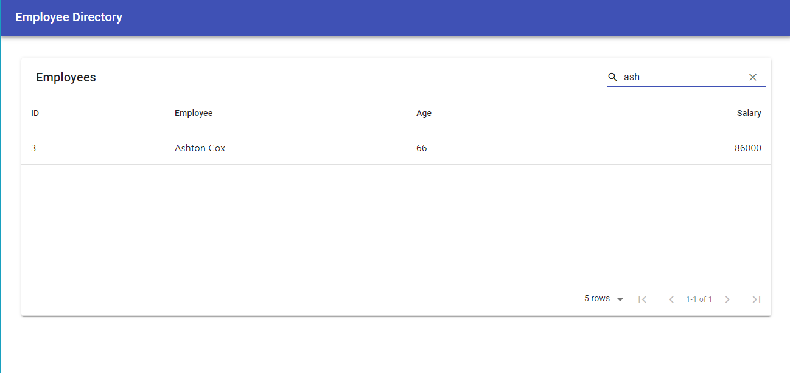

# React Employee Directory

Homework #19 of MSU Full Stack Coding Boot Camp

## Overview

For this assignment, you'll create a employee directory with React. This assignment will require you to break up your application's UI into components, manage component state, and respond to user events.

## User Story

* As a user, I want to be able to view my entire employee directory at once so that I have quick access to their information.

## Acceptance Criteria

Given a table of random users, when the user loads the page, a table of employees should render.

The user should be able to:

  * Sort the table by at least one category

  * Filter the users by at least one property.

## Screenshots

## Links

[Github Repo](https://github.com/stephanie-hall/react-employee-directory)
[Heroku](https://hw19-react-employee.herokuapp.com/)